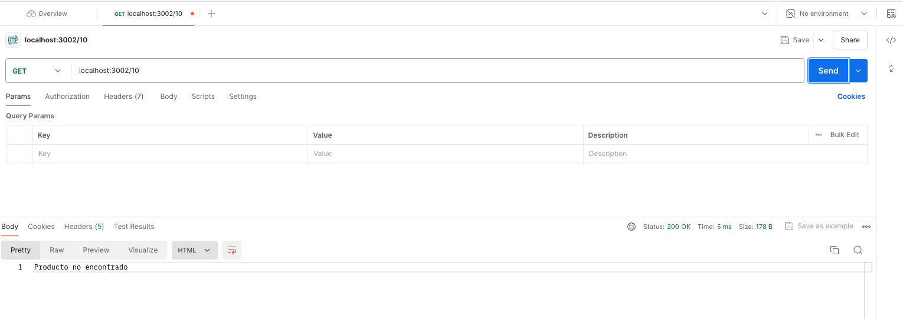

# Creación API básica con NodeJS

1. Para este ejercicio de creación de una API básica con NodeJS, se tuvo como base
la creción de dos EndPoints: Productos y Productos/:id.

2. Para la v2 de la creación de este API, la consulta se basó en la creación de un archivo
JSON con funcionalidad de base de datos, el cual contiene toda la información asociada a los
productos disponibles en esta API.

3. En el archivo index.js se realizó la solución del proyecto basado en NodeJS y con el apoyo 
de las librerías: http, fs y dotenv, las cuales fueron previamente instaladas con npm.

4. Se utilizó el puerto 3002 para abrir la conexiòn del servidor HTTP
y con ayuda de Postman se realizó la acción 'get' para capturar la información alojada en 
nuestra API básica.

5. Se tienen algunos mensajes de apoyo para identificar si se obtienen errores desde Postman 
cuando se ejecuta la acción 'get' los cuales ayudarán al front o al back a entender mejor 
cómo se está comportando la consulta hacia la API.

### Resultados obtenidos desde Postman

* `Consulta de la base de datos con los productos`

* `Consulta de la base de datos por ID de los productos`

* `Error de producto no encontrado`

