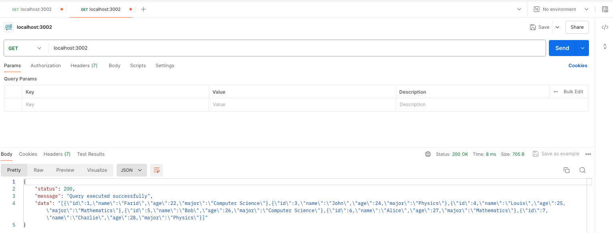
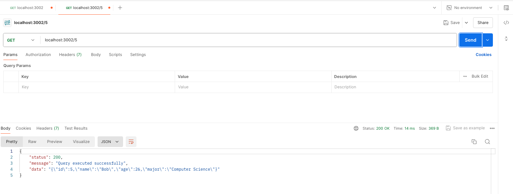
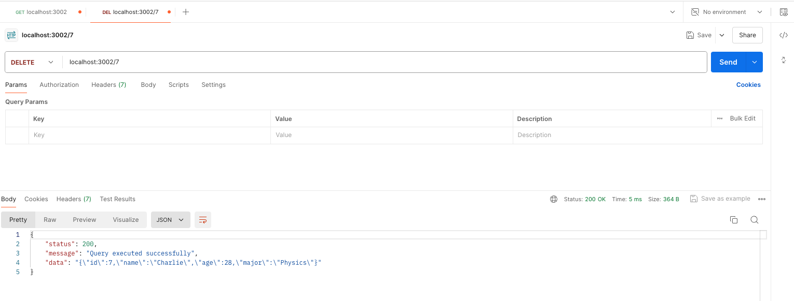
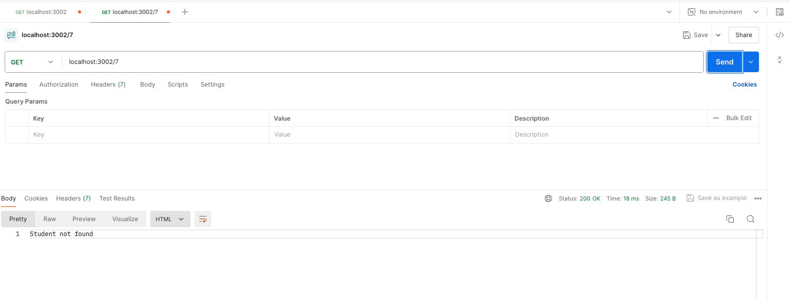

# Creación API básica con Express

1. Para este ejercicio de creación de una API básica con NodeJS, se tuvo como base
la creción de dos EndPoints: Students y Students/:id.

2. Para esta versión, se incluyó una DB separada en el archivo JSON: students.json.

3. En el archivo index.js se realizó la solución del proyecto basado en NodeJS y con el apoyo de las librerías: http, fs, express y dotenv, las cuales fueron previamente instaladas con npm.

4. Se utilizó el puerto 3002 para abrir la conexión del servidor HTTP
y con ayuda de Postman se realizaron las acciones 'get' y 'delete' para capturar y/o eleiminar la información alojada en nuestra API básica. Si la opción escogida es la de "eliminar", el archivo JSON se actualiza de manera automática.

5. Se tienen algunos mensajes de apoyo para identificar si se obtienen errores desde Postman cuando se ejecutan las acciones 'get' o 'delete' los cuales ayudarán al front o al back a entender mejor cómo se está comportando la consulta hacia la API.

### Resultados obtenidos desde Postman

* `Consulta de la base de datos con los estudiantes activos`

* `Consulta de la base de datos por ID de los estudiantes activos`

* `Delete de estudiante con ID:#7`

* `Consulta a base de datos de estudiantes activos con ID:#7`

